# neural machine translation by jointly learning to align and translate

a from-scratch pytorch implementation of bahdanau, cho & bengio (iclr 2015, arxiv 1409.0473). every layer is built from `nn.Module` primitives — no pre-built seq2seq, no library attention, no `nn.GRU`.



## the core idea

the baseline rnnencdec compresses the whole source sentence into one fixed-length vector. long sentences lose information at the bottleneck.

rnnsearch replaces that bottleneck with a soft attention mechanism: each decoder step computes its own context vector as a weighted sum of source annotations.



the 7.5+ bleu jump from rnnencdec-30 to rnnsearch-30 is the paper's headline result.

## gru cell

the gated hidden unit of cho 2014. the encoder variant has no context input. the decoder variant adds context c_i to each gate and to the candidate.



- update gate z mixes the old state and the candidate: `s_i = (1-z) s_{i-1} + z s_tilde`
- reset gate r gates the old state into the candidate
- both gates are sigmoid (values in 0..1), candidate is tanh (values in -1..1)

## alignment and attention

the alignment model is a single-layer perceptron: `e_ij = v_a^T tanh(W_a s_{i-1} + U_a h_j)`.

U_a h_j is precomputed once per source sentence and reused across all decoder steps.



softmax over the source axis gives the attention weights alpha_ij. each row sums to 1 over valid positions. padded positions are masked to -inf before softmax.



## maxout deep output

the output head is a deep output layer. the pre-activation tensor has 2l = 1000 units. adjacent pairs max-pool into l = 500 units, then W_o projects to 30000 logits.



## data pipeline

raw sentence pairs flow through tokenize -> vocabulary shortlist -> length filter -> bucketing.



- tokenize: moses-style, apostrophe-aware, utf-8
- shortlist: 30 000 most frequent words per language; the rest map to `[UNK]`
- filter: two modes — pairs up to 30 words (mode 1) or 50 words (mode 2)
- rebucket: every 20 updates, fetch 1600 pairs, sort by length, cut 20 batches of 80

## training

sgd with adadelta (rho=0.95, eps=1e-6). gradient l2 norm is clipped to 1.0 when it exceeds it.



## decoding

beam search of width 10. hypothesis score is the log-probability of the sequence. the moment a hypothesis emits the end-of-sequence token it freezes.



unk suppress: when the flag is on, the decoder never emits `[UNK]` during no-unk evaluation.

## architecture constants

all constants live in `nmt/config.py`.

| constant | value | meaning |
|----------|-------|---------|
| hidden | 1000 | gated hidden units in decoder and each encoder direction |
| embedding | 620 | word embedding dimensionality |
| alignment_hidden | 1000 | units in the alignment model hidden layer |
| maxout | 500 | hidden units after max-pooling |
| vocab | 30000 | shortlist of most frequent words per language |
| max_len_30 | 30 | mode 1: train on pairs up to 30 words |
| max_len_50 | 50 | mode 2: train on pairs up to 50 words |

## models

| model | description |
|-------|-------------|
| rnnsearch | bidirectional gru encoder, attention decoder, maxout deep output |
| rnnencdec | same code, context fixed to the last forward encoder state |

## layout

- `nmt/config.py` paper constants
- `nmt/model/` gru cells, encoder, alignment, attention, decoder, head
- `nmt/data/` parallel corpus, filtering, bucketing, collation
- `nmt/train/` adadelta, gradient clip, checkpoints, early stop
- `nmt/decode/` greedy and beam search with unk guard
- `nmt/eval/` bleu from scratch, subsets, tables
- `nmt/exp/` run configs and experiment driver

## usage

```bash
python -m nmt.cli train --config experiments.yaml
python -m nmt.cli translate --checkpoint runs/best.pt --input test.en
python -m nmt.cli evaluate --hypotheses out.fr --references test.fr
```

## tests

```bash
python -m pytest tests/ -v
```

## initialization scheme (appendix b.1)

| parameter | init |
|-----------|------|
| recurrent matrices (u, u_z, u_r) | random orthogonal |
| alignment weights (w_a, u_a) | normal(0, 0.001^2) |
| alignment vector v_a and all biases | zero |
| every other weight matrix | normal(0, 0.01^2) |

## paper results (table 1 — bleu on wmt14 en->fr test)

| method | all sentences | no unk subset |
|--------|-------------|-------------|
| rnnencdec-30 | 13.93 | 24.19 |
| rnnsearch-30 | 21.50 | 31.44 |
| rnnencdec-50 | 17.82 | 26.71 |
| rnnsearch-50 | 26.75 | 34.16 |
| rnnsearch-50* | 28.45 | 36.15 |
| moses baseline | 33.30 | 35.63 |

\* trains until dev nll stops improving.
